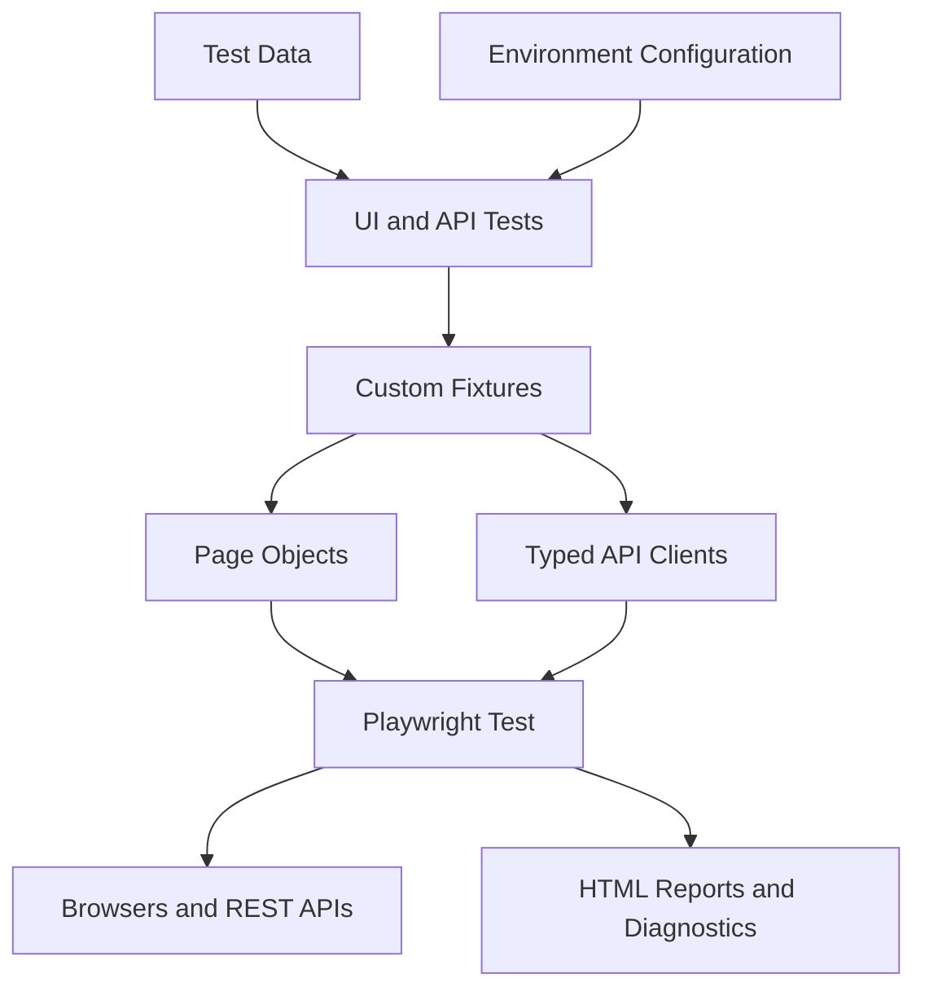

# Playwright TypeScript UI & API Test Automation Framework

[](https://github.com/venkatr184/playwright-typescript-automation-framework/actions/workflows/playwright.yml)
[](https://playwright.dev/)
[](https://www.typescriptlang.org/)
[](https://nodejs.org/)

A production-style **Playwright TypeScript test automation framework** for **UI automation and REST API testing**. It demonstrates scalable quality-engineering practices using **Page Object Model (POM)**, reusable **Playwright fixtures**, typed API clients and models, data-driven testing, environment-based configuration, test tagging, cross-browser execution, reporting, code-quality gates, and **GitHub Actions CI/CD**.

This repository is designed as both a working automation framework and a professional portfolio project demonstrating architecture-level approaches to building maintainable, reusable, and CI-ready end-to-end test automation.

## What This Project Demonstrates

- Designing a scalable Playwright TypeScript automation framework
- Combining UI and REST API automation in a single test solution
- Separating test intent from reusable page and API interaction layers
- Using fixtures for dependency injection and lifecycle management
- Applying TypeScript models to API request and response handling
- Supporting smoke, regression, UI, API, and browser-specific execution
- Managing environment-dependent configuration outside test logic
- Enforcing type checking, linting, and formatting as quality gates
- Integrating automated tests into GitHub Actions CI/CD
- Producing actionable reports, traces, screenshots, and videos for troubleshooting

## Key Features

- UI and REST API automation in one Playwright framework
- Page Object Model for maintainable UI interactions
- Reusable custom fixtures for page-object injection
- Typed API clients and request/response models
- Data-driven UI test coverage
- Environment configuration through `dotenv`
- Chromium, Firefox, and WebKit browser projects
- Dedicated API project
- Smoke, regression, UI, and API tags
- TypeScript, ESLint, and Prettier quality gates
- GitHub Actions execution for pull requests, main-branch changes, scheduled runs, and manual runs
- Playwright HTML reporting and CI artifacts
- CI retries and controlled worker configuration
- Screenshots, videos, and traces for failure diagnostics

## Architecture

The framework follows a layered design so test scenarios remain readable while implementation details are isolated in reusable components.



### Architectural Responsibilities

| Layer             | Responsibility                                                   |
| ----------------- | ---------------------------------------------------------------- |
| Tests             | Business scenarios, assertions, tags, and test intent            |
| Fixtures          | Dependency injection and reusable test setup                     |
| Page Objects      | UI locators and reusable browser interactions                    |
| API Clients       | REST endpoint interactions and API operations                    |
| API Models        | Strongly typed request/response structures                       |
| Test Data         | Scenario input separated from test implementation                |
| Configuration     | Environment-specific runtime values                              |
| Playwright Config | Projects, browsers, retries, workers, reporters, and diagnostics |
| CI/CD             | Automated quality checks and suite execution                     |

### Execution Flow

```text
Test Scenario
    |
    +--> Custom Fixture
    |       |
    |       +--> Page Object --> Browser / Web Application
    |       |
    |       +--> API Client --> REST API
    |
    +--> Test Data
    |
    +--> Environment Configuration
    |
    +--> Assertions
    |
    +--> Playwright Reporter / Trace / Screenshot / Video
```

This separation keeps tests focused on behavior while reusable implementation logic remains centralized.

## Project Structure

```text
playwright-typescript-automation-framework/
├── .github/
│   └── workflows/
│       └── playwright.yml           # GitHub Actions CI pipeline
├── api/
│   ├── clients/
│   │   └── posts.client.ts          # Reusable Posts API client
│   └── models/
│       └── post.model.ts            # Typed API models
├── config/
│   └── environment.ts               # Environment configuration loader
├── fixtures/
│   └── page.fixture.ts              # Custom Playwright fixtures
├── pages/
│   ├── home.page.ts                 # Home page object
│   ├── input-fields.page.ts         # Input-fields page object
│   └── practice.page.ts             # Practice page object
├── test-data/
│   └── input-fields.data.ts         # UI test data
├── tests/
│   ├── api/
│   │   └── posts.spec.ts            # REST API tests
│   ├── smoke/
│   │   └── home-page.spec.ts        # Critical smoke coverage
│   └── ui/
│       └── input-fields.spec.ts      # UI functional tests
├── utils/                            # Shared utility functions
├── .env.example                     # Environment-variable template
├── .prettierignore                  # Prettier exclusions
├── .prettierrc.json                 # Prettier configuration
├── eslint.config.mjs                # ESLint configuration
├── package.json                     # Dependencies and npm scripts
├── playwright.config.ts             # Playwright projects and runtime settings
└── tsconfig.json                    # TypeScript configuration
```

## Technology Stack

| Area                  | Technology                                            |
| --------------------- | ----------------------------------------------------- |
| Test framework        | Playwright Test                                       |
| Programming language  | TypeScript                                            |
| Runtime               | Node.js                                               |
| UI automation         | Playwright browser automation                         |
| API automation        | Playwright APIRequestContext / typed API client layer |
| UI design pattern     | Page Object Model                                     |
| Dependency management | Playwright custom fixtures                            |
| API design            | Typed client and model layers                         |
| Test strategy         | Smoke, regression, UI, API, and cross-browser testing |
| Configuration         | dotenv and cross-env                                  |
| Static analysis       | TypeScript compiler and ESLint                        |
| Formatting            | Prettier                                              |
| CI/CD                 | GitHub Actions                                        |
| Reporting             | Playwright HTML reporter and test artifacts           |
| Diagnostics           | Screenshots, videos, and Playwright traces            |

## Test Automation Strategy

The framework supports multiple execution dimensions without duplicating test logic:

- **Smoke testing** for fast validation of critical functionality
- **Regression testing** for broader functional coverage
- **UI testing** for browser-based workflows
- **API testing** for REST service validation
- **Cross-browser testing** across Chromium, Firefox, and WebKit
- **Data-driven testing** for reusable scenario coverage
- **CI testing** for pull requests, main-branch changes, schedules, and manual runs

Tests remain independent so they can execute in different orders and support parallel execution where appropriate.

## Prerequisites

- Node.js 22.x or a compatible active LTS release
- npm
- Git

## Getting Started

### 1. Clone the repository

```bash
git clone https://github.com/venkatr184/playwright-typescript-automation-framework.git
cd playwright-typescript-automation-framework
```

### 2. Install dependencies

```bash
npm ci
```

### 3. Install Playwright browsers

```bash
npx playwright install --with-deps
```

On Windows, the following command is normally sufficient:

```bash
npx playwright install
```

### 4. Configure the environment

Copy the example environment file and update the values for your target environment:

```bash
cp .env.example .env
```

For Windows Command Prompt:

```bat
copy .env.example .env
```

> Never commit `.env`, passwords, access tokens, or other sensitive values. CI secrets should be configured through repository secrets or environment variables.

## Running the Tests

### Complete suite

```bash
npm test
```

### Tagged suites

| Suite      | Command                   |
| ---------- | ------------------------- |
| Smoke      | `npm run test:smoke`      |
| Regression | `npm run test:regression` |
| UI         | `npm run test:ui-suite`   |
| API        | `npm run test:api-suite`  |

### Browser-specific execution

| Browser/project | Command                 |
| --------------- | ----------------------- |
| Chromium        | `npm run test:chromium` |
| Firefox         | `npm run test:firefox`  |
| WebKit          | `npm run test:webkit`   |
| API project     | `npm run test:api`      |

### Interactive and debugging modes

| Mode                 | Command               |
| -------------------- | --------------------- |
| Headed               | `npm run test:headed` |
| Playwright UI        | `npm run test:ui`     |
| Debug                | `npm run test:debug`  |
| Explicit `.env` file | `npm run test:env`    |

### List tests without executing them

```bash
npm run test:smoke_list
npm run test:regression_list
npm run test:ui-suite_list
npm run test:api-suite_list
```

## Test Tags

Tests are organized using Playwright title tags:

| Tag           | Purpose                                   |
| ------------- | ----------------------------------------- |
| `@smoke`      | Fast validation of critical functionality |
| `@regression` | Broader functional regression coverage    |
| `@ui`         | Browser-based UI coverage                 |
| `@api`        | REST API coverage                         |

A test can belong to more than one suite, allowing the same scenario to support multiple execution strategies without duplication.

## Code Quality

Run the complete local quality gate:

```bash
npm run check
```

This command runs:

1. TypeScript type checking
2. ESLint validation
3. Prettier formatting validation

Individual commands are also available:

```bash
npm run typecheck
npm run lint
npm run lint:fix
npm run format
npm run format:check
```

Run `npm run check` before pushing changes so the same validations can pass in CI.

## Reports and Failure Diagnostics

Playwright generates an interactive HTML report for test execution. Depending on the configured capture policy, failed or retried tests can include:

- Screenshots
- Videos
- Playwright traces
- Console and action logs

Open the latest local HTML report with:

```bash
npm run report
```

Diagnostic output is stored in the configured local test-results and report directories. CI uploads smoke and regression reports as GitHub Actions artifacts even when tests fail, unless the workflow is cancelled.

These diagnostics support root-cause analysis by preserving browser actions and execution evidence around failures.

## Execution Evidence

### Framework Architecture

The framework separates tests, fixtures, page objects, API clients, configuration, and test data to support maintainability and independent execution.


### GitHub Actions Pipeline

Pull requests execute quality checks and smoke tests. Changes merged into `main` additionally execute the complete regression suite.


### Playwright HTML Report

The Playwright HTML report contains test results, browser/project information, execution duration, errors, attachments, and traces.


## Continuous Integration and CI/CD

The workflow is defined in `.github/workflows/playwright.yml`.

| Trigger                | Quality checks | Smoke tests | Full regression |
| ---------------------- | -------------: | ----------: | --------------: |
| Pull request to `main` |            Yes |         Yes |              No |
| Push to `main`         |            Yes |         Yes |             Yes |
| Weekday schedule       |            Yes |          No |             Yes |
| Manual execution       |            Yes |         Yes |             Yes |

The GitHub Actions pipeline provides:

- npm dependency caching
- Read-only repository permissions
- Concurrency control that cancels outdated runs
- Job-level timeouts
- Quality checks before test execution
- Playwright browser and Linux dependency installation
- Smoke reports retained for 14 days
- Regression reports retained for 30 days

Failed quality checks or tests return a non-zero exit code, allowing the workflow to act as a pull-request quality gate when branch protection is enabled.

## Framework Design Principles

- Keep business scenarios and assertions in tests.
- Keep reusable UI interactions in page objects.
- Keep reusable REST interactions in typed API clients.
- Prefer user-facing Playwright locators such as roles, labels, and test IDs.
- Keep test data separate from test logic.
- Use fixtures for dependency injection and lifecycle management.
- Keep tests independent so they can run in any order and in parallel.
- Use strongly typed request and response models for safer API automation.
- Store environment-specific values outside source code.
- Apply code-quality checks before test execution.
- Capture rich diagnostics when they provide troubleshooting value.
- Keep CI behavior predictable and reproducible.

## Security and Configuration Practices

- Sensitive credentials are not stored in source control.
- `.env.example` documents expected configuration without exposing secrets.
- Local environment values are kept outside committed source code.
- CI credentials should be stored using GitHub repository or environment secrets.
- GitHub Actions uses read-only repository permissions where write access is unnecessary.

## Portfolio and Engineering Value

This project demonstrates capabilities relevant to **QA Automation Engineer, SDET, Test Automation Architect, and Quality Engineering** roles, including:

- Automation framework architecture
- Playwright and TypeScript engineering
- UI and REST API test automation
- Page Object Model implementation
- Reusable fixture design
- Typed API abstraction
- Cross-browser automation
- Test tagging and execution strategy
- CI/CD integration with GitHub Actions
- Static analysis and code-quality gates
- Failure diagnostics and reporting
- Maintainable test-project organization

## Roadmap

Potential future enhancements include:

- API schema or contract validation
- Accessibility testing
- Visual regression testing
- Test-result trend reporting
- Containerized test execution
- Additional reusable utilities and test-data strategies

## Author

**Venkata Reddy K**  
QA Automation Architect | Playwright | TypeScript | API Automation | CI/CD

- GitHub: [venkatr184](https://github.com/venkatr184)

## Project Purpose

This repository is an educational and professional portfolio project created to demonstrate scalable test-automation architecture and modern quality-engineering practices using Playwright, TypeScript, REST API automation, and GitHub Actions CI/CD.
