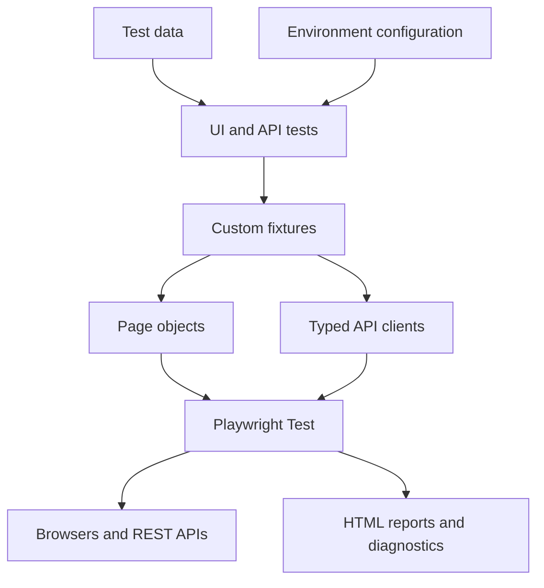
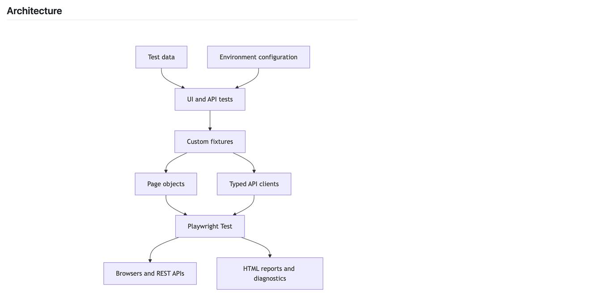
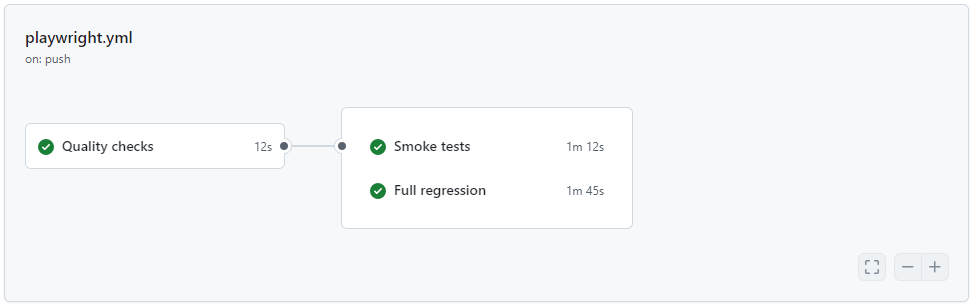
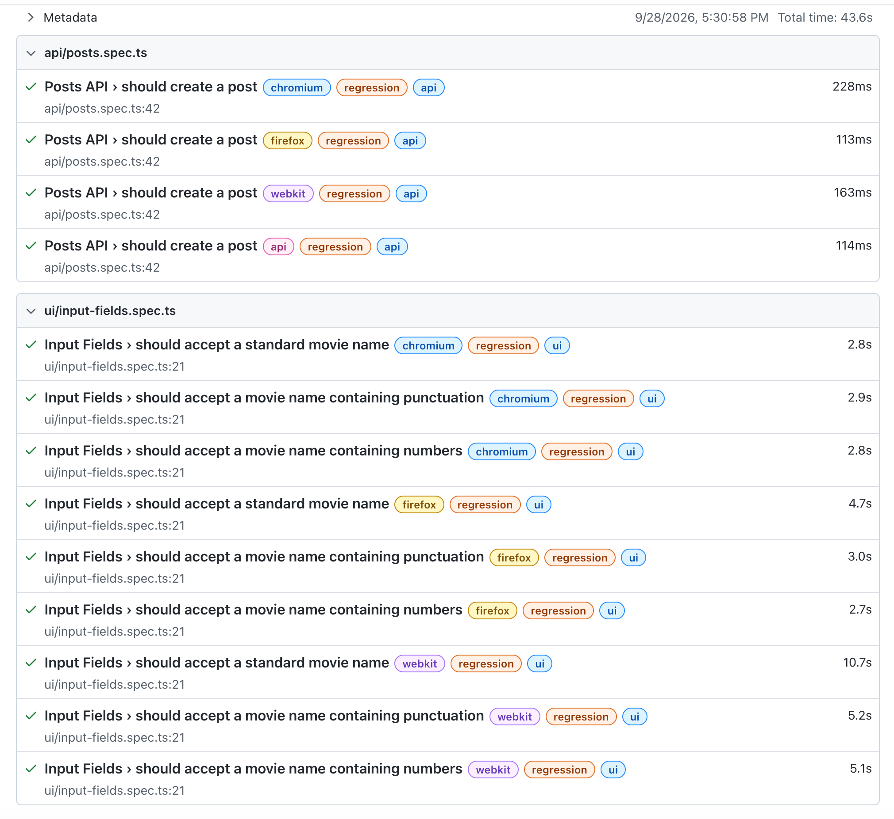

# Playwright TypeScript Automation Framework

[](https://github.com/venkatr184/playwright-typescript-automation-framework/actions/workflows/playwright.yml)
[](https://playwright.dev/)
[](https://www.typescriptlang.org/)
[](https://nodejs.org/)

A portfolio-ready UI and API test automation framework built with Playwright and TypeScript. The project demonstrates maintainable test architecture, Page Object Model design, reusable fixtures, typed API clients, environment-based configuration, tagged test execution, cross-browser coverage, quality gates, and continuous integration with GitHub Actions.

## Key Features

- UI and REST API automation in one Playwright framework
- Page Object Model for maintainable UI interactions
- Reusable custom fixtures for page-object injection
- Typed API clients and request/response models
- Data-driven UI test coverage
- Environment configuration through `dotenv`
- Chromium, Firefox, and WebKit browser projects
- Dedicated API project
- Smoke, regression, UI, and API tags
- TypeScript, ESLint, and Prettier quality gates
- GitHub Actions execution for pull requests, main-branch changes, scheduled runs, and manual runs
- HTML reports and diagnostic artifacts for troubleshooting failures
- CI retries, controlled workers, screenshots, videos, and traces configured through Playwright

## Architecture



## Project Structure

```text
playwright-typescript-automation-framework/
├── .github/
│   └── workflows/
│       └── playwright.yml           # GitHub Actions CI pipeline
├── api/
│   ├── clients/
│   │   └── posts.client.ts          # Reusable Posts API client
│   └── models/
│       └── post.model.ts            # Typed API models
├── config/
│   └── environment.ts               # Environment configuration loader
├── fixtures/
│   └── page.fixture.ts              # Custom Playwright fixtures
├── pages/
│   ├── home.page.ts                 # Home page object
│   ├── input-fields.page.ts         # Input-fields page object
│   └── practice.page.ts             # Practice page object
├── test-data/
│   └── input-fields.data.ts         # UI test data
├── tests/
│   ├── api/
│   │   └── posts.spec.ts            # REST API tests
│   ├── smoke/
│   │   └── home-page.spec.ts        # Critical smoke coverage
│   └── ui/
│       └── input-fields.spec.ts      # UI functional tests
├── utils/                            # Shared utility functions
├── .env.example                     # Environment-variable template
├── .prettierignore                  # Prettier exclusions
├── .prettierrc.json                 # Prettier configuration
├── eslint.config.mjs                # ESLint configuration
├── package.json                     # Dependencies and npm scripts
├── playwright.config.ts             # Playwright projects and runtime settings
└── tsconfig.json                    # TypeScript configuration
```

## Technology Stack

| Area                 | Technology                                  |
| -------------------- | ------------------------------------------- |
| Test framework       | Playwright Test                             |
| Programming language | TypeScript                                  |
| Runtime              | Node.js                                     |
| UI design pattern    | Page Object Model                           |
| API design           | Typed client and model layers               |
| Configuration        | dotenv and cross-env                        |
| Static analysis      | TypeScript compiler and ESLint              |
| Formatting           | Prettier                                    |
| CI/CD                | GitHub Actions                              |
| Reporting            | Playwright HTML reporter and test artifacts |

## Prerequisites

- Node.js 22.x or a compatible active LTS release
- npm
- Git

## Getting Started

### 1. Clone the repository

```bash
git clone https://github.com/venkatr184/playwright-typescript-automation-framework.git
cd playwright-typescript-automation-framework
```

### 2. Install dependencies

```bash
npm ci
```

### 3. Install Playwright browsers

```bash
npx playwright install --with-deps
```

On Windows, the following command is normally sufficient:

```bash
npx playwright install
```

### 4. Configure the environment

Copy the example environment file and update the values for your target environment:

```bash
cp .env.example .env
```

For Git Bash on Windows, the same command works. For Windows Command Prompt, use:

```bat
copy .env.example .env
```

> Never commit `.env`, passwords, access tokens, or other sensitive values. CI secrets should be configured through repository secrets or environment variables.

## Running the Tests

### Complete suite

```bash
npm test
```

### Tagged suites

| Suite      | Command                   |
| ---------- | ------------------------- |
| Smoke      | `npm run test:smoke`      |
| Regression | `npm run test:regression` |
| UI         | `npm run test:ui-suite`   |
| API        | `npm run test:api-suite`  |

### Browser-specific execution

| Browser/project | Command                 |
| --------------- | ----------------------- |
| Chromium        | `npm run test:chromium` |
| Firefox         | `npm run test:firefox`  |
| WebKit          | `npm run test:webkit`   |
| API project     | `npm run test:api`      |

### Interactive and debugging modes

| Mode                 | Command               |
| -------------------- | --------------------- |
| Headed               | `npm run test:headed` |
| Playwright UI        | `npm run test:ui`     |
| Debug                | `npm run test:debug`  |
| Explicit `.env` file | `npm run test:env`    |

### List tests without executing them

```bash
npm run test:smoke_list
npm run test:regression_list
npm run test:ui-suite_list
npm run test:api-suite_list
```

## Test Tags

Tests are organized using Playwright title tags:

| Tag           | Purpose                                   |
| ------------- | ----------------------------------------- |
| `@smoke`      | Fast validation of critical functionality |
| `@regression` | Broader functional regression coverage    |
| `@ui`         | Browser-based UI coverage                 |
| `@api`        | REST API coverage                         |

A test can belong to more than one suite, allowing the same scenario to support multiple execution strategies without duplication.

## Code Quality

Run the complete local quality gate:

```bash
npm run check
```

This command runs:

1. TypeScript type checking
2. ESLint validation
3. Prettier formatting validation

Individual commands are also available:

```bash
npm run typecheck
npm run lint
npm run lint:fix
npm run format
npm run format:check
```

Run `npm run check` before pushing changes so that the same validations pass in CI.

## Reports and Failure Diagnostics

## Execution Evidence

### Framework Architecture

The framework separates tests, fixtures, page objects, API clients, configuration, and test data to support maintainability and independent execution.



### GitHub Actions Pipeline

Pull requests execute quality checks and smoke tests. Changes merged into `main` additionally execute the complete regression suite.



### Playwright HTML Report

Playwright generates an interactive HTML report containing test results, browser/project information, execution duration, errors, attachments, and traces.



After a local test run, open the Playwright HTML report with:

```bash
npm run report
```

Depending on the configured capture policy, failed or retried tests can include:

- Screenshots
- Videos
- Playwright traces
- Console and action logs

These diagnostics are stored in the local test-results and report directories. CI uploads the smoke and regression reports as downloadable GitHub Actions artifacts even when tests fail, unless the workflow is cancelled.

## Continuous Integration

The workflow is defined in `.github/workflows/playwright.yml`.

| Trigger                | Quality checks | Smoke tests | Full regression |
| ---------------------- | -------------: | ----------: | --------------: |
| Pull request to `main` |            Yes |         Yes |              No |
| Push to `main`         |            Yes |         Yes |             Yes |
| Weekday schedule       |            Yes |          No |             Yes |
| Manual execution       |            Yes |         Yes |             Yes |

The pipeline provides:

- npm dependency caching
- Read-only repository permissions
- Concurrency control that cancels outdated runs
- Job-level timeouts
- Quality checks before test execution
- Playwright browser and Linux dependency installation
- Smoke reports retained for 14 days
- Regression reports retained for 30 days

Failed quality checks or tests return a non-zero exit code, allowing the workflow to act as a pull-request quality gate when branch protection is enabled.

## Design Principles

- Keep assertions in tests and reusable interactions in page objects or API clients.
- Prefer user-facing Playwright locators such as roles, labels, and test IDs.
- Keep test data separate from test logic.
- Use fixtures for dependency injection and lifecycle management.
- Keep tests independent so they can run in any order and in parallel.
- Use strongly typed request and response models for safer API automation.
- Store environment-specific values outside the source code.
- Capture rich diagnostics only when they provide troubleshooting value.

## Roadmap

- Add branch protection with required CI status checks
- Add framework architecture and execution screenshots
- Add schema or contract validation for API responses
- Add accessibility and visual-regression coverage
- Add test-result trend reporting
- Add containerized execution

## Author

**Venkata Reddy K**  
QA Automation Architect | Playwright | TypeScript | API Automation | CI/CD

- GitHub: [venkatr184](https://github.com/venkatr184)

## Project Purpose

This repository is an educational and professional portfolio project created to demonstrate scalable test-automation design and modern quality-engineering practices.
